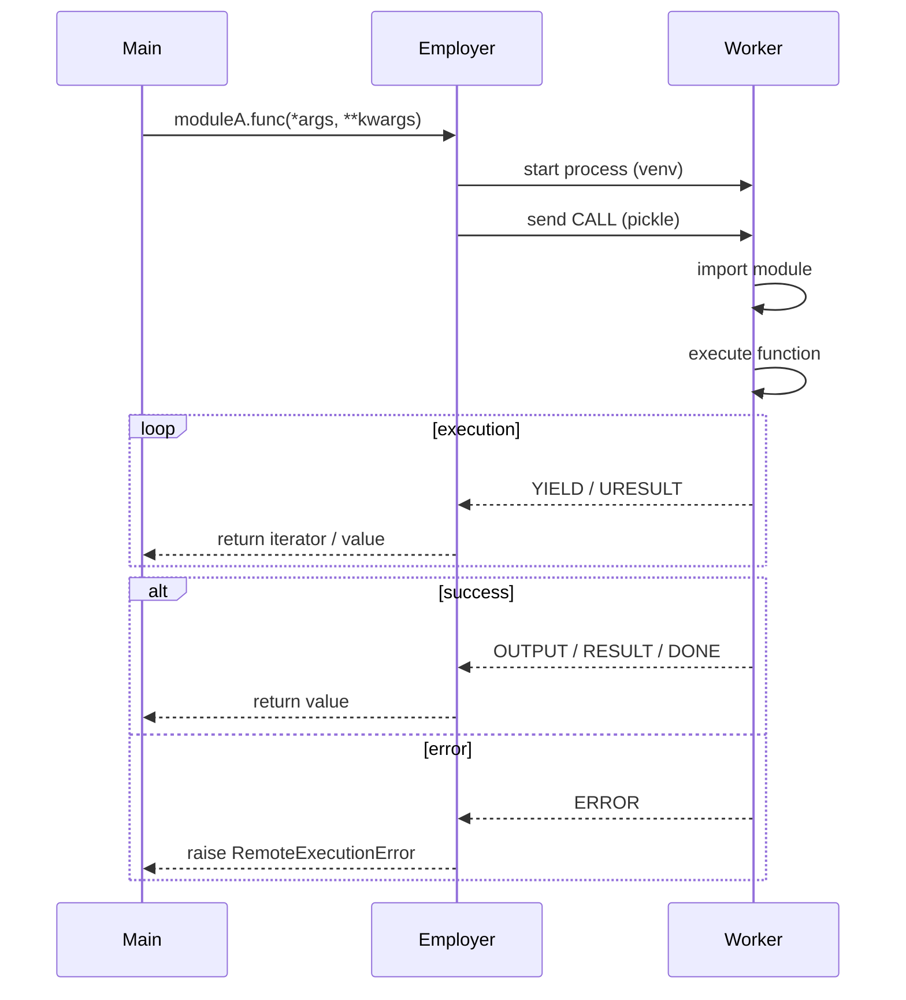
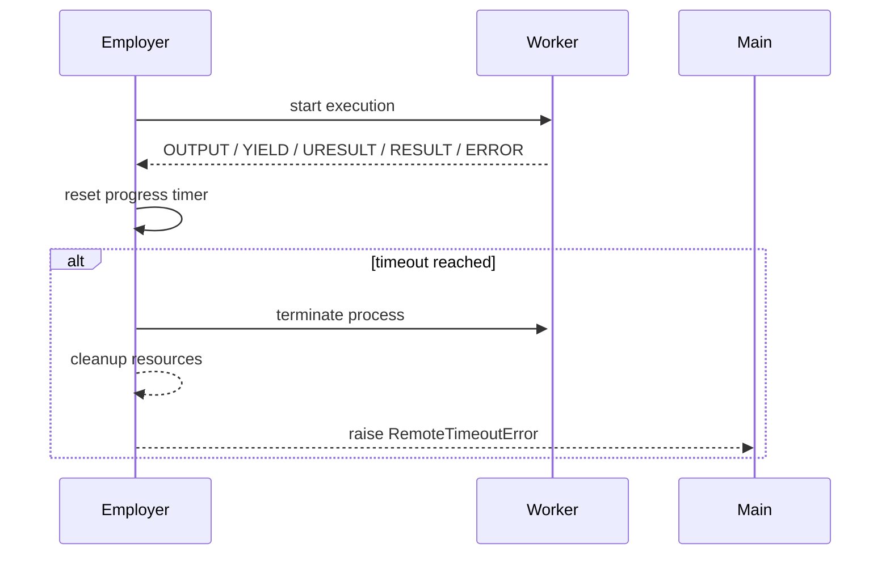

 
 
 
 

# MultiEnvEmployer

[English](README.md) | [Русский](README_RU.md)

**MultiEnvEmployer** — is a library for calling functions and generators from Python modules located in **other virtual environments**, including environments with **different Python versions** and **conflicting dependencies**.

The library is intended for situations where code **cannot be physically imported**, but needs to be invoked and controlled from a single main process.

---

## Contents

* [Project Purpose](#project-purpose)
* [Installation](#installation)
* [Minimal Example and Initialization](#minimal-example-and-initialization)
* [Core Concept](#core-concept)
* [Data Exchange Architecture](#data-exchange-architecture)
* [Function Call Lifecycle](#function-call-lifecycle)
* [RESULT and URESULT — what they are](#result-and-uresult---what-they-are)
* * [RESULT](#result)
* * [URESULT (streamed return)](#uresult-streamed-return)
* [Supported Data Types](#supported-data-types)
* * [Large data (via URESULT)](#large-data-via-uresult)
* * [Small data](#small-data)
* [Intercepting print()](#intercepting-print)
* [Execution Timeouts](#execution-timeouts)
* * [none](#none)
* * [absolute](#absolute)
* * [progress](#progress)
* * [Watchdog and timeout behavior](#watchdog-and-timeout-behavior)
* [Caching](#caching)
* [Project Structure](#project-structure)
* [Process Management](#process-management)
* [Error Handling](#error-handling)
* [Asynchronous Functions Inside Modules](#asynchronous-functions-inside-modules)
* [What the library **does not do**](#what-the-library-does-not-do)
* [Summary](#summary)
* [License](#license)

---

## Project Purpose

The project solves the task of:

* running Python code in an **isolated virtualenv**
* calling functions as ordinary Python functions
* transferring data between processes
* managing execution lifetime
* intercepting `print()`
* handling errors as regular exceptions

The project **is not a dev tool**, debugging wrapper, or build system.
It is used **during program runtime** as an infrastructure layer.

---

## Installation

**Installation via repository**

```bash
git clone https://github.com/REYIL/MultiEnvEmployer.git
cd MultiEnvEmployer
```

**Installation via pip**

```bash
pip install multi-env-employer
```

---

## Minimal Example and Initialization

1. **Minimal Example**

```python
from MultiEnvEmployer import Employer, RemoteModule

emp = Employer("/path/to/project", "/path/to/venv")
moduleA = RemoteModule(emp, "moduleA")

result = moduleA.add(2, 4)
print(result)
```

2. **Initializing Employer**

```python
Employer(
    project_dir: str,
    venv_path: str,
    pickle_protocol: int = 4
)
```

**Parameters:**

* `project_dir`
  Path to the project directory containing Python modules to execute.

* `venv_path`
  Path to the virtual environment in which the worker will run.

* `pickle_protocol`
  Serialization protocol used for data exchange between processes.

  Used for:

  * function arguments
  * return values (`RESULT`, `URESULT`)
  * `yield` messages
  * errors and system messages

  Allows:

  * working with different Python versions
  * controlling compatibility and serialized data size

3. **Initializing RemoteModule**

```python
RemoteModule(
    employer: Employer,
    module_name: str,
    output: str = "terminal",
    caching: bool = False,
    timeout_seconds: int | None = None,
    timeout_mode: str = "none"
)
```

**Parameters:**

* `employer`
  An instance of `Employer` through which code will be executed.

* `module_name`
  The Python module name without `.py`.
  The module must be located in `project_dir`.

* `output`
  `print()` handling mode:

  * `"terminal"`
  * `"logger"`
  * `"terminal|logger"`
  * `"none"`

* `caching`
  Enables or disables file-based `RESULT` caching.

  Important:

  * only regular `return` values are cached
  * `yield` and `URESULT` are not cached

* `timeout_seconds`
  Maximum wait time for a response.

* `timeout_mode`
  Timeout mode:

  * `"none"` - no limit
  * `"absolute"` - hard timeout
  * `"progress"` - timeout resets on any response (print, yield, return, error)

---

## Core Concept

In the main project, you initialize `Employer`, specifying:

* the path to the project with the code
* the path to the virtualenv where this code should run

Then you create a `RemoteModule` and call functions as if they were local:

```python
res = moduleA.add(1, 2)
```

Internally:

* a separate Python process is created
* the specified virtualenv is used
* the code runs in isolation
* the result is returned to the main process

---

## Data Exchange Architecture

Communication between the main process and the worker occurs via a **single binary channel** using `pickle`.

Each message is a dictionary with a fixed format.

### Message Types

| Type      | Description                     |
| --------- | ------------------------------- |
| `RESULT`  | Regular function return value   |
| `YIELD`   | A single value sent via `yield` |
| `URESULT` | Part of a large return value    |
| `OUTPUT`  | Intercepted `print()`           |
| `DONE`    | Function execution finished     |
| `ERROR`   | Execution error                 |

> Users **do not interact directly** with these messages — they are described for understanding system behavior.

---

## Function Call Lifecycle

Below is the full lifecycle of a single function call through `RemoteModule`, including `yield`, streamed data, and error handling.



---

## RESULT and URESULT — what they are

### RESULT

`RESULT` is a regular function return value (`return`).

Used for:

* small data
* data that fits entirely in memory

### URESULT (streamed return)

`URESULT` is used when a function returns **large data**.

In this case:

* data is **split into chunks**
* each chunk is sent separately
* after sending, the chunk is **removed from the worker’s memory**
* the final object is reconstructed on the Employer side

For the user, it behaves like a normal `return`.

---

## Supported Data Types

### Small Data

Supported without restrictions:

* `str`
* `int`
* `bool`
* `list`
* `tuple`
* `set`
* `dict`
* `None`

### Large Data (via URESULT)

Supported:

* `str`
* `list`
* `tuple`
* `numpy.ndarray`

> If data is considered large, the library automatically uses streaming.

---

## Intercepting print()

All `print()` calls inside a remote module:

* **do not write directly to stdout**
* **do not break the pickle protocol**
* are redirected to the Employer

The user chooses the handling mode:

* `"terminal"` — print to terminal
* `"logger"` — send to logger
* `"terminal|logger"` — both
* `"none"` — ignore output

---

## Execution Timeouts

Timeouts are applied **at the Employer level**.

Supported modes:

### `none`

No time restrictions.

### `absolute`

Hard timer starting from the function launch.
If time expires, the worker is forcibly terminated.

### `progress`

Timer resets on **any event**:

* `print`
* `yield`
* `URESULT`
* `RESULT`
* `ERROR`

If no events occur — execution is considered stalled.

### Watchdog and timeout behavior

The diagram below shows how Employer monitors worker activity and decides on termination.



---

## Caching

Caching is implemented **on the Employer side** and stored in the **file system**.

Features:

* only `RESULT` is cached
* generators and yield streams are not cached
* cache is shared across all Employer calls
* cache path is automatically determined in the system user directory

Example (Windows):

```
C:\Users\<USER>\AppData\Local\MultiEnvEmployer\
```

---

## Project Structure

```
MultiEnvEmployer
├── employer
│   ├── MessageReader.py      # Reading and routing messages
│   ├── OutputHandler.py      # Handling print()
│   ├── UReturnIterator.py    # Streaming RESULT reconstruction
│   ├── Watchdog.py           # Timeouts and execution control
│   ├── YieldIterator.py      # Iteration over yield
│   └── employer.py           # Worker process management
│
├── remote
│   └── remote_module.py      # User API
│
├── utils
│   ├── CacheAppDirs.py       # Cache paths
│   ├── FileCache.py          # File cache
│   └── errors.py             # Custom exceptions
│
├── worker
│   ├── introspection.py      # Function and signature analysis
│   └── worker.py             # Code execution
│
└── __init__.py
```

---

## Process Management

```python
emp.close()                           # stop all processes
emp.close(moduleA.add)                # stop a specific function
emp.close("moduleA.add")              # string version
emp.close([moduleA.add, moduleA.tt])  # list of functions
emp.close(["moduleA.add", "moduleA.tt"])
```

---

## Error Handling

All errors are converted to custom exceptions:

* `WrongArgumentsError` — signature mismatch
* `RemoteExecutionError` — error inside the module
* `RemoteTimeoutError` — timeout
* `RemoteCloseFunction` — forced termination
* `RemoteImportError` — import failure

Example:

```python
try:
    moduleA.erorm()
except errors.RemoteExecutionError as e:
    print(e)
```

---

## Asynchronous Functions Inside Modules

If a function inside the module is `async`, it executes correctly inside the worker.
From the user's perspective, the call remains synchronous.

---

## What the library **does not do**

* does not optimize user code
* does not analyze algorithms
* does not interfere with module logic
* does not "fix" stalled functions

If code stalls — it must be stopped by timeout or manually.

---

## Summary

MultiEnvEmployer is an infrastructure layer that allows you to:

* execute Python code in other environments
* manage its execution
* safely and controllably receive data

No hidden magic, no altering Python behavior, explicit and controlled execution.

---

## License

The project is available under the **[MIT License](LICENSE)** — free to use, modify, and distribute.
