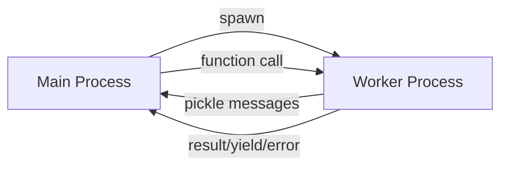

 
 
 
 

# MultiEnvEmployer

[English](README.md) | [Русский](README_RU.md)

**MultiEnvEmployer** is a library for safely executing code from different Python virtual environments as regular functions.

Execute functions from isolated environments with different Python versions and conflicting dependencies without import conflicts or version issues.

---

## Contents

* [Project Purpose](#project-purpose)
* [Installation](#installation)
* [Quick Start](#quick-start)
* [Core Concepts](#core-concepts)
* [API Reference](#api-reference)
  * [Employer](#employer)
  * [RemoteModule](#remotemodule)
  * [TimeoutPolicy](#timeoutpolicy)
* [Features](#features)
  * [Stateful vs Stateless](#stateful-vs-stateless)
  * [Print Interception](#print-interception)
  * [Timeout Modes](#timeout-modes)
  * [Caching](#caching)
  * [Generators](#generators)
  * [Large Data Streaming](#large-data-streaming)
* [Error Handling](#error-handling)
* [Process Management](#process-management)
* [Advanced Usage](#advanced-usage)
* [Limitations](#limitations)
* [License](#license)

---

## Project Purpose

MultiEnvEmployer solves the problem of:

* Running Python code in **isolated virtual environments**
* Calling functions as if they were local
* Transferring data between processes
* Managing execution lifetime and timeouts
* Intercepting output (`print`)
* Handling errors as regular exceptions

The project **is not a dev tool**, debugging wrapper, or build system.
It is used **during program runtime** as an infrastructure layer.

---

## Installation

**Via pip:**

```bash
pip install multi-env-employer
```

**Via repository:**

```bash
git clone https://github.com/REYIL/MultiEnvEmployer.git
cd MultiEnvEmployer
pip install -e .
```

---

## Quick Start

**Run the demonstration:**

```bash
python main.py
```

This demonstrates all library features including:
- Employer initialization with custom settings
- Module connections (stateless, stateful, cached)
- Function introspection
- Basic function calls
- Print interception (terminal and logger)
- Generators and async functions
- Stateful behavior
- Result caching
- Various data types
- Large data streaming
- Timeout modes
- Error handling
- Cross-module imports
- Process management
- Context manager usage

**Run tests:**

```bash
python test.py
```

Tests verify all functionality and save results to `logs/test_results_py{version}.log`

**Basic usage example:**

```python
from pathlib import Path
from MultiEnvEmployer import Employer, RemoteModule

# Initialize employer with target environment
emp = Employer(
    project_dir=Path("path/to/modules"),
    venv_path=Path("path/to/venv")
)

# Connect to remote module
module = RemoteModule(emp, "my_module")

# Call functions as if they were local
result = module.add(2, 3)
print(result)  # 5

# Use context manager for automatic cleanup
with Employer("path/to/modules", "path/to/venv") as emp:
    module = RemoteModule(emp, "my_module")
    result = module.process_data([1, 2, 3])
```

---

## Core Concepts

### Architecture

MultiEnvEmployer uses a **process-based architecture**:

1. **Main Process** (your code) creates an `Employer`
2. **Employer** spawns **Worker Processes** in target virtual environments
3. **Workers** execute code and communicate via pickle protocol
4. Results are returned to the main process



### Message Types

Communication uses typed messages:

| Type | Description |
|------|-------------|
| `RESULT` | Regular function return value |
| `YIELD` | Generator yield value |
| `URESULT` | Streamed large data chunk |
| `OUTPUT` | Intercepted print() |
| `DONE` | Execution completed |
| `ERROR` | Exception occurred |

---

## API Reference

### Employer

Main class for managing worker processes.

```python
Employer(
    project_dir: Path,
    venv_path: Path,
    cache_path: Path = None,
    pickle_protocol: int = 4
)
```

**Parameters:**

* `project_dir` - Directory containing Python modules to execute
* `venv_path` - Path to virtual environment for workers
* `cache_path` - Optional custom cache directory
* `pickle_protocol` - Pickle protocol version (default: 4)

**Methods:**

* `cache_clear()` - Clear result cache
* `close(modules=None)` - Terminate processes (all or specific)
* `get_functions(module_name)` - Get available functions in module

**Context Manager:**

```python
with Employer(project_dir, venv_path) as emp:
    # Automatic cleanup on exit
    pass
```

---

### RemoteModule

Proxy for remote module access.

```python
RemoteModule(
    employer: Employer,
    module_name: str,
    print_output: str = "terminal",
    logger: logging.Logger = None,
    stateful: bool = False,
    caching: bool = False,
    timeout: TimeoutPolicy = None
)
```

**Parameters:**

* `employer` - Employer instance
* `module_name` - Module name (without .py)
* `print_output` - Output mode: `"terminal"`, `"logger"`, `"terminal|logger"`, `"none"`
* `logger` - Logger instance (required if output mode includes "logger")
* `stateful` - Keep process alive between calls (default: False)
* `caching` - Enable result caching (default: False)
* `timeout` - Timeout policy (default: 60s progress mode)

**Properties:**

* `__remote__.functions` - Dictionary of available functions with signatures

---

### TimeoutPolicy

Configuration for execution timeouts.

```python
from MultiEnvEmployer import TimeoutPolicy

timeout = TimeoutPolicy(
    seconds=60,
    mode="progress"  # "none", "absolute", or "progress"
)
```

**Modes:**

* `none` - No timeout
* `absolute` - Hard limit from function start
* `progress` - Reset timer on any activity (print, yield, return)

---

## Features

### Stateful vs Stateless

**Stateless (default):**
- New process per function call
- No shared state between calls
- Automatic cleanup after execution

```python
module = RemoteModule(emp, "my_module", stateful=False)
module.func1()  # Process A
module.func2()  # Process B
```

**Stateful:**
- Single process for all calls
- Shared module-level state
- Manual cleanup required

```python
module = RemoteModule(emp, "my_module", stateful=True)
module.set_value(10)  # Process A
module.get_value()    # Process A (same process)
```

---

### Print Interception

All `print()` calls in remote modules are intercepted and redirected:

```python
# Remote module
def my_function():
    print("Hello from worker")
    return 42

# Main process
module = RemoteModule(emp, "my_module", print_output="terminal")
result = module.my_function()
# Output: Hello from worker
```

**Output modes:**
- `"terminal"` - Print to stdout
- `"logger"` - Send to logger
- `"terminal|logger"` - Both
- `"none"` - Discard output

---

### Timeout Modes

**None:**
```python
timeout = TimeoutPolicy(seconds=60, mode="none")
# No timeout, function can run indefinitely
```

**Absolute:**
```python
timeout = TimeoutPolicy(seconds=30, mode="absolute")
# Hard 30-second limit from start
```

**Progress:**
```python
timeout = TimeoutPolicy(seconds=10, mode="progress")
# 10 seconds of inactivity allowed
# Timer resets on print/yield/return
```

---

### Caching

Enable caching to store function results:

```python
module = RemoteModule(emp, "my_module", caching=True)

result1 = module.expensive_function(x=10)  # Executes
result2 = module.expensive_function(x=10)  # From cache
```

**Notes:**
- Only `RESULT` (return values) are cached
- Generators and yields are not cached
- Cache key includes module, function, args, and kwargs
- Cache is file-based and persistent

---

### Generators

Generators work transparently:

```python
# Remote module
def count_to(n):
    for i in range(n):
        yield i

# Main process
module = RemoteModule(emp, "my_module")
for value in module.count_to(5):
    print(value)  # 0, 1, 2, 3, 4
```

---

### Large Data Streaming

Large return values are automatically streamed in chunks:

```python
# Remote module
def get_large_list():
    return ["data"] * 10_000_000  # Automatically streamed

# Main process
module = RemoteModule(emp, "my_module")
result = module.get_large_list()  # Received in chunks
```

**Supported types for streaming:**
- `str`
- `list`
- `tuple`
- `numpy.ndarray`

**Threshold:** 1 MB (configurable in worker)

---

## Error Handling

All errors are converted to custom exceptions:

```python
from MultiEnvEmployer import errors

try:
    result = module.failing_function()
except errors.RemoteExecutionError as e:
    print(f"Remote error: {e.error_type}")
    print(f"Message: {e.error_message}")
    print(f"Traceback:\n{e.remote_traceback}")
except errors.RemoteTimeoutError as e:
    print(f"Timeout after {e.timeout_seconds}s")
except errors.WrongArgumentsError as e:
    print(f"Invalid arguments: {e.details}")
```

**Exception hierarchy:**

```
MultiEnvEmployerError
├── RemoteError
│   ├── RemoteExecutionError
│   ├── RemoteTimeoutError
│   ├── RemoteCloseFunction
│   ├── RemoteCloseModule
│   ├── TypeMessageNotFound
│   ├── FailedIntrospectModule
│   └── RemoteFunctionNotFound
└── WrongArgumentsError
```

---

## Process Management

**Close specific module:**
```python
emp.close(module)
emp.close("module_name")
```

**Close specific function (stateless):**
```python
emp.close("module_name.function_name")
```

**Close all processes:**
```python
emp.close()
```

**Automatic cleanup:**
```python
# Via context manager
with Employer(project_dir, venv_path) as emp:
    pass  # Automatic cleanup

# Via atexit (registered automatically)
emp = Employer(project_dir, venv_path)
# Cleanup on program exit
```

---

## Advanced Usage

### Async Functions

Async functions in remote modules are automatically handled:

```python
# Remote module
async def async_operation(x):
    await asyncio.sleep(1)
    return x * 2

# Main process (synchronous call)
module = RemoteModule(emp, "my_module")
result = module.async_operation(5)  # Returns 10
```

### Signature Validation

Arguments are validated before execution:

```python
# Remote module
def add(a: int, b: int) -> int:
    return a + b

# Main process
module = RemoteModule(emp, "my_module")
module.add(1, 2)      # OK
module.add(1)         # Raises WrongArgumentsError
module.add(1, 2, 3)   # Raises WrongArgumentsError
```

### Introspection

Get available functions:

```python
module = RemoteModule(emp, "my_module")
functions = module.__remote__.functions

for name, info in functions.items():
    print(f"{name}{info['signature']}")
```

---

## Limitations

**What the library does NOT do:**

* Does not optimize user code
* Does not analyze algorithms
* Does not interfere with module logic
* Does not "fix" stalled functions

**Security considerations:**

* ⚠️ **CRITICAL**: This library uses pickle for inter-process communication. **Never use with untrusted data sources**
* Pickle can execute arbitrary code during deserialization
* Only use MultiEnvEmployer with code and data you control
* Not suitable for processing user-supplied data or external inputs

**Known constraints:**

* Pickle protocol limitations apply
* Functions must be pickle-serializable
* No shared memory between processes
* Overhead from process spawning and IPC

---

## License

The project is available under the **[MIT License](LICENSE)** — free to use, modify, and distribute.

---

## Contact

For issues and questions:
- GitHub Issues: https://github.com/REYIL/MultiEnvEmployer/issues
- Telegram: [@REYIL_DEV](https://t.me/REYIL_DEV)
