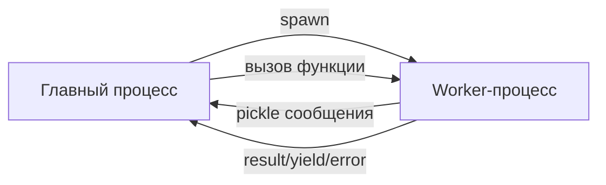

&nbsp;
&nbsp;
&nbsp;
&nbsp;

# MultiEnvEmployer

[English](README.md) | [Русский](README_RU.md)

**MultiEnvEmployer** — библиотека для безопасного выполнения кода из разных виртуальных окружений Python как обычных функций.

Выполняйте функции из изолированных окружений с разными версиями Python и конфликтующими зависимостями без конфликтов импорта или проблем с версиями.

---

## Содержание

* [Назначение проекта](#назначение-проекта)
* [Установка](#установка)
* [Быстрый старт](#быстрый-старт)
* [Основные концепции](#основные-концепции)
* [Справочник API](#справочник-api)
  * [Employer](#employer)
  * [RemoteModule](#remotemodule)
  * [TimeoutPolicy](#timeoutpolicy)
* [Возможности](#возможности)
  * [Stateful vs Stateless](#stateful-vs-stateless)
  * [Перехват print](#перехват-print)
  * [Режимы таймаута](#режимы-таймаута)
  * [Кэширование](#кэширование)
  * [Генераторы](#генераторы)
  * [Потоковая передача больших данных](#потоковая-передача-больших-данных)
* [Обработка ошибок](#обработка-ошибок)
* [Управление процессами](#управление-процессами)
* [Продвинутое использование](#продвинутое-использование)
* [Ограничения](#ограничения)
* [Лицензия](#лицензия)

---

## Назначение проекта

Проект решает задачу:

* запуска Python-кода в **изолированном virtualenv**
* вызова функций как обычных Python-функций
* передачи данных между процессами
* управления временем жизни выполнения
* перехвата вывода (`print`)
* обработки ошибок как обычных исключений

Проект **не является dev-инструментом**, обёрткой для отладки или системой сборки.
Он используется **во время выполнения программы** как инфраструктурный слой.

---

## Установка

**Установка через pip:**

```bash
pip install multi-env-employer
```

**Установка через репозиторий:**

```bash
git clone https://github.com/REYIL/MultiEnvEmployer.git
cd MultiEnvEmployer
pip install -e .
```

---

## Быстрый старт

**Запуск демонстрации:**

```bash
python main.py
```

Демонстрирует все возможности библиотеки:
- Инициализация Employer с настройками
- Подключение модулей (stateless, stateful, cached)
- Интроспекция функций
- Базовые вызовы функций
- Перехват print (terminal и logger)
- Генераторы и async функции
- Stateful поведение
- Кэширование результатов
- Различные типы данных
- Потоковая передача больших данных
- Режимы timeout
- Обработка ошибок
- Импорт между модулями
- Управление процессами
- Использование context manager

**Запуск тестов:**

```bash
python test.py
```

Тесты проверяют всю функциональность и сохраняют результаты в `logs/test_results_py{version}.log`

**Пример базового использования:**

```python
from pathlib import Path
from MultiEnvEmployer import Employer, RemoteModule

# Инициализация employer с целевым окружением
emp = Employer(
    project_dir=Path("path/to/modules"),
    venv_path=Path("path/to/venv")
)

# Подключение к удалённому модулю
module = RemoteModule(emp, "my_module")

# Вызов функций как локальных
result = module.add(2, 3)
print(result)  # 5

# Использование контекстного менеджера для автоматической очистки
with Employer("path/to/modules", "path/to/venv") as emp:
    module = RemoteModule(emp, "my_module")
    result = module.process_data([1, 2, 3])
```

---

## Основные концепции

### Архитектура

MultiEnvEmployer использует **процессную архитектуру**:

1. **Главный процесс** (ваш код) создаёт `Employer`
2. **Employer** запускает **Worker-процессы** в целевых виртуальных окружениях
3. **Worker'ы** выполняют код и общаются через pickle-протокол
4. Результаты возвращаются в главный процесс



### Типы сообщений

Коммуникация использует типизированные сообщения:

| Тип | Описание |
|------|-------------|
| `RESULT` | Обычное возвращаемое значение функции |
| `YIELD` | Значение yield генератора |
| `URESULT` | Чанк больших данных (потоковая передача) |
| `OUTPUT` | Перехваченный print() |
| `DONE` | Выполнение завершено |
| `ERROR` | Произошло исключение |

---

## Справочник API

### Employer

Основной класс для управления worker-процессами.

```python
Employer(
    project_dir: Path,
    venv_path: Path,
    cache_path: Path = None,
    pickle_protocol: int = 4
)
```

**Параметры:**

* `project_dir` - Директория с Python-модулями для выполнения
* `venv_path` - Путь к виртуальному окружению для worker'ов
* `cache_path` - Опциональная пользовательская директория кэша
* `pickle_protocol` - Версия протокола pickle (по умолчанию: 4)

**Методы:**

* `cache_clear()` - Очистить кэш результатов
* `close(modules=None)` - Завершить процессы (все или конкретные)
* `get_functions(module_name)` - Получить доступные функции в модуле

**Контекстный менеджер:**

```python
with Employer(project_dir, venv_path) as emp:
    # Автоматическая очистка при выходе
    pass
```

---

### RemoteModule

Прокси для доступа к удалённому модулю.

```python
RemoteModule(
    employer: Employer,
    module_name: str,
    print_output: str = "terminal",
    logger: logging.Logger = None,
    stateful: bool = False,
    caching: bool = False,
    timeout: TimeoutPolicy = None
)
```

**Параметры:**

* `employer` - Экземпляр Employer
* `module_name` - Имя модуля (без .py)
* `print_output` - Режим вывода: `"terminal"`, `"logger"`, `"terminal|logger"`, `"none"`
* `logger` - Экземпляр логгера (требуется, если режим вывода включает "logger")
* `stateful` - Сохранять процесс между вызовами (по умолчанию: False)
* `caching` - Включить кэширование результатов (по умолчанию: False)
* `timeout` - Политика таймаута (по умолчанию: 60с в режиме progress)

**Свойства:**

* `__remote__.functions` - Словарь доступных функций с сигнатурами

---

### TimeoutPolicy

Конфигурация таймаутов выполнения.

```python
from MultiEnvEmployer import TimeoutPolicy

timeout = TimeoutPolicy(
    seconds=60,
    mode="progress"  # "none", "absolute", или "progress"
)
```

**Режимы:**

* `none` - Без таймаута
* `absolute` - Жёсткий лимит от начала функции
* `progress` - Сброс таймера при любой активности (print, yield, return)

---

## Возможности

### Stateful vs Stateless

**Stateless (по умолчанию):**
- Новый процесс для каждого вызова функции
- Нет общего состояния между вызовами
- Автоматическая очистка после выполнения

```python
module = RemoteModule(emp, "my_module", stateful=False)
module.func1()  # Процесс A
module.func2()  # Процесс B
```

**Stateful:**
- Единый процесс для всех вызовов
- Общее состояние на уровне модуля
- Требуется ручная очистка

```python
module = RemoteModule(emp, "my_module", stateful=True)
module.set_value(10)  # Процесс A
module.get_value()    # Процесс A (тот же процесс)
```

---

### Перехват print

Все вызовы `print()` в удалённых модулях перехватываются и перенаправляются:

```python
# Удалённый модуль
def my_function():
    print("Привет из worker'а")
    return 42

# Главный процесс
module = RemoteModule(emp, "my_module", print_output="terminal")
result = module.my_function()
# Вывод: Привет из worker'а
```

**Режимы вывода:**
- `"terminal"` - Вывод в stdout
- `"logger"` - Отправка в логгер
- `"terminal|logger"` - Оба варианта
- `"none"` - Отбросить вывод

---

### Режимы таймаута

**None:**
```python
timeout = TimeoutPolicy(seconds=60, mode="none")
# Без таймаута, функция может выполняться бесконечно
```

**Absolute:**
```python
timeout = TimeoutPolicy(seconds=30, mode="absolute")
# Жёсткий лимит 30 секунд от начала
```

**Progress:**
```python
timeout = TimeoutPolicy(seconds=10, mode="progress")
# Допускается 10 секунд бездействия
# Таймер сбрасывается при print/yield/return
```

---

### Кэширование

Включите кэширование для сохранения результатов функций:

```python
module = RemoteModule(emp, "my_module", caching=True)

result1 = module.expensive_function(x=10)  # Выполняется
result2 = module.expensive_function(x=10)  # Из кэша
```

**Примечания:**
- Кэшируются только `RESULT` (возвращаемые значения)
- Генераторы и yield не кэшируются
- Ключ кэша включает модуль, функцию, args и kwargs
- Кэш файловый и персистентный

---

### Генераторы

Генераторы работают прозрачно:

```python
# Удалённый модуль
def count_to(n):
    for i in range(n):
        yield i

# Главный процесс
module = RemoteModule(emp, "my_module")
for value in module.count_to(5):
    print(value)  # 0, 1, 2, 3, 4
```

---

### Потоковая передача больших данных

Большие возвращаемые значения автоматически передаются чанками:

```python
# Удалённый модуль
def get_large_list():
    return ["data"] * 10_000_000  # Автоматически передаётся потоком

# Главный процесс
module = RemoteModule(emp, "my_module")
result = module.get_large_list()  # Получено чанками
```

**Поддерживаемые типы для потоковой передачи:**
- `str`
- `list`
- `tuple`
- `numpy.ndarray`

**Порог:** 1 МБ (настраивается в worker)

---

## Обработка ошибок

Все ошибки преобразуются в пользовательские исключения:

```python
from MultiEnvEmployer import errors

try:
    result = module.failing_function()
except errors.RemoteExecutionError as e:
    print(f"Удалённая ошибка: {e.error_type}")
    print(f"Сообщение: {e.error_message}")
    print(f"Traceback:\n{e.remote_traceback}")
except errors.RemoteTimeoutError as e:
    print(f"Таймаут после {e.timeout_seconds}с")
except errors.WrongArgumentsError as e:
    print(f"Неверные аргументы: {e.details}")
```

**Иерархия исключений:**

```
MultiEnvEmployerError
├── RemoteError
│   ├── RemoteExecutionError
│   ├── RemoteTimeoutError
│   ├── RemoteCloseFunction
│   ├── RemoteCloseModule
│   ├── TypeMessageNotFound
│   ├── FailedIntrospectModule
│   └── RemoteFunctionNotFound
└── WrongArgumentsError
```

---

## Управление процессами

**Закрыть конкретный модуль:**
```python
emp.close(module)
emp.close("module_name")
```

**Закрыть конкретную функцию (stateless):**
```python
emp.close("module_name.function_name")
```

**Закрыть все процессы:**
```python
emp.close()
```

**Автоматическая очистка:**
```python
# Через контекстный менеджер
with Employer(project_dir, venv_path) as emp:
    pass  # Автоматическая очистка

# Через atexit (регистрируется автоматически)
emp = Employer(project_dir, venv_path)
# Очистка при выходе из программы
```

---

## Продвинутое использование

### Асинхронные функции

Асинхронные функции в удалённых модулях обрабатываются автоматически:

```python
# Удалённый модуль
async def async_operation(x):
    await asyncio.sleep(1)
    return x * 2

# Главный процесс (синхронный вызов)
module = RemoteModule(emp, "my_module")
result = module.async_operation(5)  # Возвращает 10
```

### Валидация сигнатуры

Аргументы валидируются перед выполнением:

```python
# Удалённый модуль
def add(a: int, b: int) -> int:
    return a + b

# Главный процесс
module = RemoteModule(emp, "my_module")
module.add(1, 2)      # OK
module.add(1)         # Вызывает WrongArgumentsError
module.add(1, 2, 3)   # Вызывает WrongArgumentsError
```

### Интроспекция

Получить доступные функции:

```python
module = RemoteModule(emp, "my_module")
functions = module.__remote__.functions

for name, info in functions.items():
    print(f"{name}{info['signature']}")
```

---

## Ограничения

**Что библиотека НЕ делает:**

* Не оптимизирует пользовательский код
* Не анализирует алгоритмы
* Не вмешивается в логику модуля
* Не "исправляет" зависшие функции

**Соображения безопасности:**

* ⚠️ **КРИТИЧНО**: Библиотека использует pickle для межпроцессного взаимодействия. **Никогда не используйте с ненадёжными источниками данных**
* Pickle может выполнять произвольный код при десериализации
* Используйте MultiEnvEmployer только с кодом и данными, которые вы контролируете
* Не подходит для обработки пользовательских данных или внешних входных данных

**Известные ограничения:**

* Применяются ограничения протокола pickle
* Функции должны быть pickle-сериализуемыми
* Нет общей памяти между процессами
* Накладные расходы от создания процессов и IPC

---

## Лицензия

Проект доступен под **[лицензией MIT](LICENSE)** — свободен для использования, модификации и распространения.

---

## Контакты

По вопросам и проблемам:
- GitHub Issues: https://github.com/REYIL/MultiEnvEmployer/issues
- Telegram: [@REYIL_DEV](https://t.me/REYIL_DEV)
