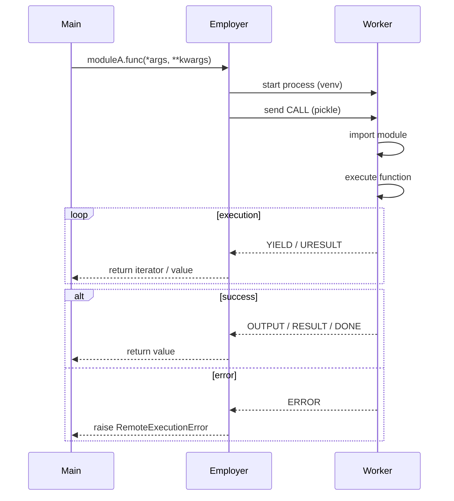
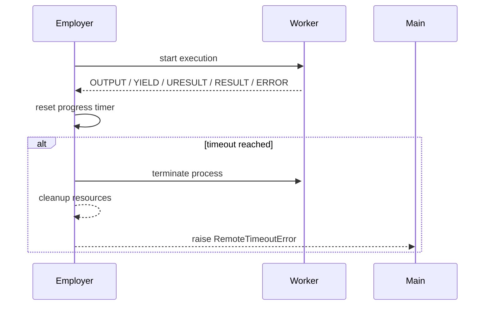

&nbsp;
&nbsp;
&nbsp;
&nbsp;


# MultiEnvEmployer

[English](README.md) | [Русский](README_RU.md)

**MultiEnvEmployer** — библиотека для вызова функций и генераторов из Python-модулей, расположенных в **других виртуальных окружениях**, включая окружения с **разными версиями Python** и **конфликтующими зависимостями**.

Библиотека предназначена для случаев, когда код **физически не может быть связан импортами**, но должен быть вызван и управляем из одного основного процесса.

---

## Содержание

- [Назначение проекта](#назначение-проекта)
- [Установка](#установка)
- [Минимальный пример и инициализация](#минимальный-пример-и-инициализация)
- [Основная концепция](#основная-концепция)
- [Архитектура обмена данными](#архитектура-обмена-данными)
- [Жизненный цикл вызова функции](#жизненный-цикл-вызова-функции)
- [RESULT и URESULT — что это](#result-и-uresult---что-это)
- - [RESULT](#result)
- - [URESULT (streamed return)](#uresult-streamed-return)
- [Поддерживаемые типы данных](#поддерживаемые-типы-данных)
- - [Большие данные (через URESULT)](#большие-данные-через-uresult)
- - [Малые данные](#малые-данные)
- [Перехват print()](#перехват-print)
- [Таймауты выполнения](#таймауты-выполнения)
- - [none](#none)
- - [absolute](#absolute)
- - [progress](#progress)
- - [Поведение watchdog и таймаутов](#поведение-watchdog-и-таймаутов)
- [Кэширование](#кэширование)
- [Структура проекта](#структура-проекта)
- [Управление процессами](#управление-процессами)
- [Обработка ошибок](#обработка-ошибок)
- [Асинхронные функции внутри модуля](#асинхронные-функции-внутри-модуля)
- [Что библиотека **не делает**](#что-библиотека-не-делает)
- [Кратко](#кратко)
- [Лицензия](#лицензия)

---

## Назначение проекта

Проект решает задачу:

* запуска Python-кода в **изолированном virtualenv**
* вызова функций как обычных Python-функций
* передачи данных между процессами
* управления временем жизни выполнения
* перехвата вывода (`print`)
* обработки ошибок как обычных исключений

Проект **не является dev-инструментом**, обёрткой для отладки или системой сборки.
Он используется **во время выполнения программы** как инфраструктурный слой.

---

## Установка

**Установка через репозиторий**

 ```bash
 git clone https://github.com/REYIL/MultiEnvEmployer.git
 cd MultiEnvEmployer
 ```

**Установка через pip**

```bash
pip install multi-env-employer
```

---

## Минимальный пример и инициализация

1. **Минимальный пример**
```python
from MultiEnvEmployer import Employer, RemoteModule

emp = Employer("/path/to/project", "/path/to/venv")
moduleA = RemoteModule(emp, "moduleA")

result = moduleA.add(2, 4)
print(result)
```

2. **Инициализация Employer**

```python
Employer(
    project_dir: str,
    venv_path: str,
    pickle_protocol: int = 4
)
```

**Параметры:**

* `project_dir`
  Путь к директории проекта, в которой находятся Python-модули для выполнения.

* `venv_path`
  Путь к виртуальному окружению, в котором будет запускаться worker.

* `pickle_protocol`
  Протокол сериализации, используемый для обмена данными между процессами.

  Используется для:

  * аргументов функций
  * возвращаемых значений (`RESULT`, `URESULT`)
  * сообщений `yield`
  * ошибок и служебных сообщений

  Позволяет:

  * работать с разными версиями Python
  * контролировать совместимость и размер сериализуемых данных

3. **Инициализация RemoteModule**

```python
RemoteModule(
    employer: Employer,
    module_name: str,
    output: str = "terminal",
    caching: bool = False,
    timeout_seconds: int | None = None,
    timeout_mode: str = "none"
)
```

**Параметры:**

* `employer`
  Экземпляр `Employer`, через который будет выполняться код.

* `module_name`
  Имя Python-модуля без расширения `.py`.
  Модуль должен находиться в `project_dir`.

* `output`
  Режим обработки `print()`:

  * `"terminal"`
  * `"logger"`
  * `"terminal|logger"`
  * `"none"`

* `caching`
  Включает или отключает файловое кэширование `RESULT`.

  Важно:

  * кэшируются только обычные `return`
  * `yield` и `URESULT` не кэшируются

* `timeout_seconds`
  Максимальное время ожидания ответа.

* `timeout_mode`
  Режим таймаута:

  * `"none"` - без ограничений
  * `"absolute"` - жёсткий таймер
  * `"progress"` - таймер сбрасывается при любом ответе (print, yield, return, error)

---

## Основная концепция

В основном проекте вы инициализируете `Employer`, указывая:

* путь к проекту с кодом
* путь к virtualenv, в котором этот код должен выполняться

Далее создаёте `RemoteModule` и вызываете функции так, будто они локальные:

```python
res = moduleA.add(1, 2)
```

Фактически при этом:

* создаётся отдельный процесс Python
* используется указанный virtualenv
* код выполняется изолированно
* результат возвращается в основной процесс

---

## Архитектура обмена данными

Обмен между основным процессом и worker’ом происходит через **единый бинарный канал** с использованием `pickle`.

Каждое сообщение — это словарь фиксированного формата.

### Типы сообщений

| Тип       | Описание                                  |
| --------- | ----------------------------------------- |
| `RESULT`  | Обычное возвращаемое значение функции     |
| `YIELD`   | Одно значение, отправленное через `yield` |
| `URESULT` | Часть большого возвращаемого значения     |
| `OUTPUT`  | Перехваченный `print()`                   |
| `DONE`    | Завершение выполнения функции             |
| `ERROR`   | Ошибка выполнения                         |

> Пользователь **не работает напрямую** с этими сообщениями — они описаны для понимания поведения системы.

---

## Жизненный цикл вызова функции

Ниже показан полный жизненный цикл одного вызова функции
через `RemoteModule`, включая `yield`, потоковую передачу
данных и обработку ошибок.



---

## RESULT и URESULT - что это

### RESULT

`RESULT` — это обычное возвращаемое значение функции (`return`).

Используется для:

* малых данных
* данных, которые можно целиком разместить в памяти

### URESULT (streamed return)

`URESULT` используется, когда функция возвращает **большие данные**.

В этом случае:

* данные **разбиваются на части**
* каждая часть отправляется отдельно
* после отправки часть **удаляется из памяти worker’а**
* итоговый объект собирается на стороне Employer

Для пользователя это выглядит как обычный `return`.

---

## Поддерживаемые типы данных

### Малые данные

Поддерживаются без ограничений:

* `str`
* `int`
* `bool`
* `list`
* `tuple`
* `set`
* `dict`
* `None`

### Большие данные (через URESULT)

Поддерживаются:

* `str`
* `list`
* `tuple`
* `numpy.ndarray`

> Если данные признаны большими, библиотека автоматически использует потоковую передачу.

---

## Перехват print()

Все вызовы `print()` внутри удалённого модуля:

* **не пишут напрямую в stdout**
* **не ломают pickle-протокол**
* перенаправляются в Employer

Пользователь выбирает режим обработки:

* `"terminal"` — вывод в терминал
* `"logger"` — передача в логгер
* `"terminal|logger"` — оба варианта
* `"none"` — вывод полностью игнорируется

---

## Таймауты выполнения

Таймауты применяются **на уровне Employer**.

Поддерживаются режимы:

### `none`

Без ограничений по времени.

### `absolute`

Жёсткий таймер с момента запуска функции.
По истечении времени worker принудительно останавливается.

### `progress`

Таймер сбрасывается при **любом событии**:

* `print`
* `yield`
* `URESULT`
* `RESULT`
* `ERROR`

Если событий нет — выполнение считается зависшим.

### Поведение watchdog и таймаутов

Диаграмма ниже показывает, как Employer отслеживает активность
worker-процесса и принимает решение о его остановке.



---

## Кэширование

Кэширование реализовано **на стороне Employer** и хранится **в файловой системе**.

Особенности:

* кэшируются только `RESULT`
* генераторы и yield-потоки не кэшируются
* кэш общий для всех вызовов Employer
* путь кэша определяется автоматически в системной директории пользователя

Пример (Windows):

```
C:\Users\<USER>\AppData\Local\MultiEnvEmployer\
```

---

## Структура проекта

```
MultiEnvEmployer
├── employer
│   ├── MessageReader.py      # Чтение и маршрутизация сообщений
│   ├── OutputHandler.py      # Обработка print()
│   ├── UReturnIterator.py    # Потоковая сборка RESULT
│   ├── Watchdog.py           # Таймауты и контроль выполнения
│   ├── YieldIterator.py      # Итерация по yield
│   └── employer.py           # Управление worker-процессами
│
├── remote
│   └── remote_module.py      # Пользовательский API
│
├── utils
│   ├── CacheAppDirs.py       # Пути хранения кэша
│   ├── FileCache.py          # Файловый кэш
│   └── errors.py             # Кастомные исключения
│
├── worker
│   ├── introspection.py      # Анализ функций и сигнатур
│   └── worker.py             # Исполнение кода
│
└── __init__.py
```

---

## Управление процессами

```python
emp.close()                           # остановить все процессы
emp.close(moduleA.add)                # остановить конкретную функцию
emp.close("moduleA.add")              # строковый вариант
emp.close([moduleA.add, moduleA.tt])  # список функций
emp.close(["moduleA.add", "moduleA.tt"])
```

---

## Обработка ошибок

Все ошибки приводятся к кастомным исключениям:

* `WrongArgumentsError` — ошибка сигнатуры
* `RemoteExecutionError` — ошибка внутри модуля
* `RemoteTimeoutError` — таймаут
* `RemoteCloseFunction` — принудительное завершение
* `RemoteImportError` — ошибка импорта

Пример:

```python
try:
    moduleA.erorm()
except errors.RemoteExecutionError as e:
    print(e)
```

---

## Асинхронные функции внутри модуля

Если функция внутри модуля является `async`, она корректно исполняется внутри worker’а.
Со стороны пользователя вызов остаётся синхронным.

---

## Что библиотека **не делает**

* не оптимизирует пользовательский код
* не анализирует алгоритмы
* не вмешивается в логику модуля
* не «лечит» зависшие функции

Если код завис — он будет остановлен по таймауту или вручную.

---

## Кратко

MultiEnvEmployer — это инфраструктурный слой, который позволяет:

* исполнять Python-код в других окружениях
* управлять его выполнением
* получать данные безопасно и контролируемо

Без скрытой магии, без подмены поведения Python, с явным и контролируемым исполнением.

---

## Лицензия

Проект доступен под лицензией **[MIT License](LICENSE)** — свободно используйте, изменяйте и распространяйте.

